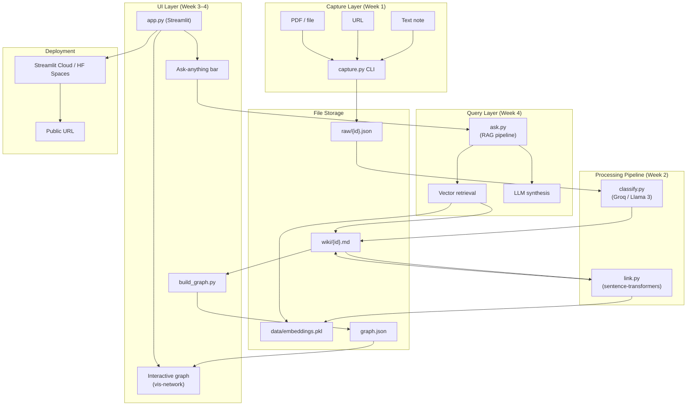
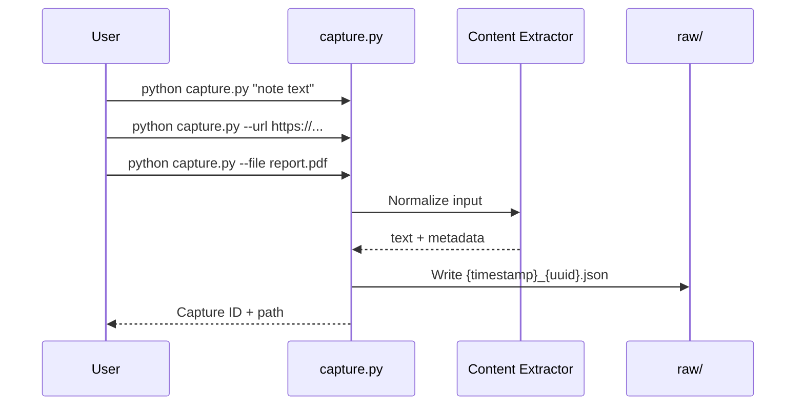
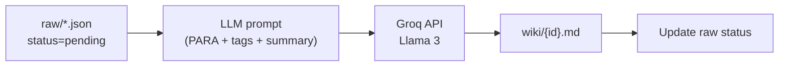
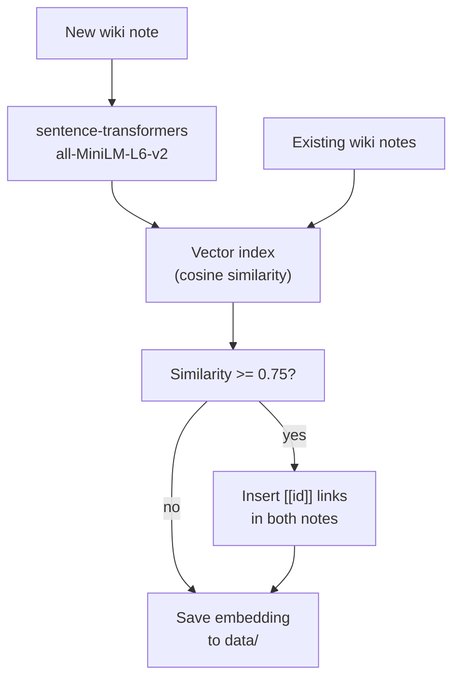
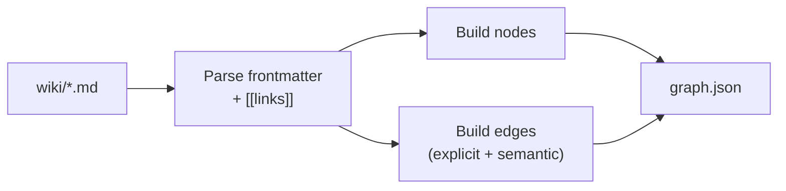
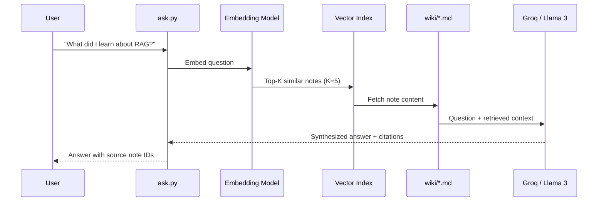
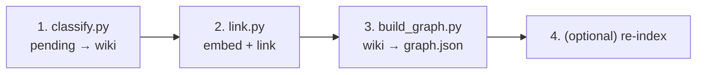
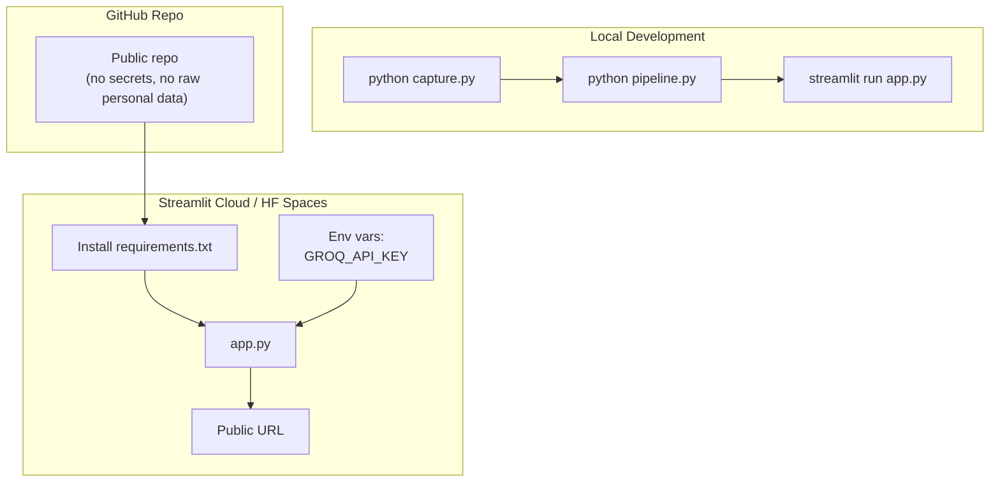
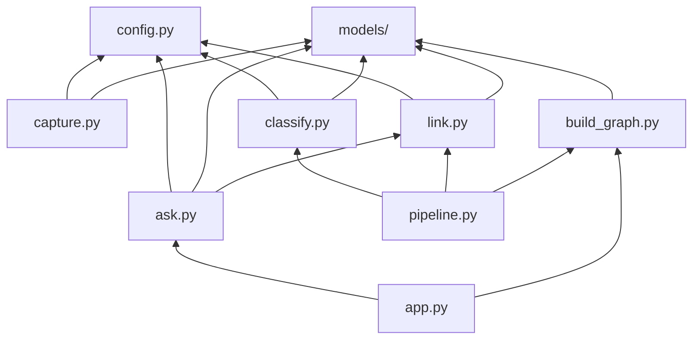

# SecondSelf — Detailed System Architecture

Based on the problem statement, **SecondSelf** is a personal knowledge system with five stages: **capture → classify → link → visualize → ask**. It is not a notes app or a generic chatbot — it is a self-organizing "second brain" backed by your own data.

---

## 1. Vision & Design Principles

| Principle | Implication |
|-----------|-------------|
| **Capture-first** | One command saves anything; friction must be near zero |
| **AI organizes, human explores** | PARA classification and linking are automated |
| **Local-first storage** | `raw/` and `wiki/` are plain files — inspectable, git-friendly |
| **Embeddings for relationships** | Semantic similarity drives auto-linking and retrieval |
| **Graph as the mental model** | Knowledge is navigated spatially, not only by folders |
| **RAG for answers** | Answers are synthesized from *your* notes, not the open web |
| **Incremental build** | Each week's output is the next week's input |

---

## 2. High-Level Architecture



---

## 3. Repository Structure

```
secondself/
├── raw/                          # Immutable captures (source of truth)
│   └── {timestamp}_{uuid}.json
├── wiki/                         # Processed, classified, linked notes
│   └── {uuid}.md
├── data/                         # Derived artifacts (not hand-edited)
│   ├── embeddings.index          # FAISS / numpy vector index
│   ├── embeddings.meta.json      # id → vector mapping
│   └── pipeline_state.json       # last-processed timestamps
├── graph.json                    # Exported nodes + edges for UI
├── capture.py                    # Week 1: CLI capture
├── classify.py                   # Week 2.1: PARA + tags + summary
├── link.py                       # Week 2.2: embeddings + auto-link
├── build_graph.py                # Week 3.1: wiki → graph.json
├── ask.py                        # Week 4.1: RAG Q&A
├── app.py                        # Week 4.2: Streamlit UI
├── pipeline.py                   # Orchestrator: raw → wiki → graph
├── config.py                     # Shared config (paths, thresholds, API keys)
├── models/                       # Pydantic/dataclass schemas
│   ├── capture.py
│   ├── note.py
│   └── graph.py
├── static/                       # JS/CSS for graph (if embedded in Streamlit)
│   └── graph.html
├── tests/
├── requirements.txt
├── .env.example
└── README.md
```

---

## 4. Core Data Models

### 4.1 Raw Capture (`raw/{id}.json`)

```json
{
  "id": "20260709_a3f9c2",
  "captured_at": "2026-07-09T09:28:57+05:30",
  "type": "note | link | file",
  "content": "Plain text or extracted text",
  "source_url": "https://...",
  "file_path": "raw/files/report.pdf",
  "mime_type": "application/pdf",
  "status": "pending | classified | linked | error",
  "metadata": {}
}
```

### 4.2 Wiki Note (`wiki/{id}.md`)

Frontmatter + markdown body with auto-inserted links:

```yaml
---
id: 20260709_a3f9c2
title: "One-line summary from LLM"
para_category: Projects | Areas | Resources | Archives
tags: [python, rag, second-brain]
summary: "One-line summary"
links: [20260708_b1e4d7, 20260707_c9a2f1]
embedding_id: 20260709_a3f9c2
created_at: ...
updated_at: ...
---
# Title

Body content with [[20260708_b1e4d7]] auto-links inline.
```

### 4.3 Graph Export (`graph.json`)

```json
{
  "nodes": [
    {
      "id": "20260709_a3f9c2",
      "label": "RAG pipeline design",
      "category": "Projects",
      "tags": ["rag"],
      "summary": "...",
      "content_preview": "First 200 chars..."
    }
  ],
  "edges": [
    {
      "source": "20260709_a3f9c2",
      "target": "20260708_b1e4d7",
      "weight": 0.87,
      "type": "semantic_similarity"
    }
  ]
}
```

---

## 5. Component Architecture (by Week)

### Week 1 — Capture Pipeline (`capture.py`)

**Responsibility:** Accept any input and persist it immutably in `raw/`.



| Input type | Handling |
|------------|----------|
| **Note** | Store as-is |
| **Link** | Fetch title + excerpt (requests + BeautifulSoup) |
| **File** | Copy to `raw/files/`, extract text (PyPDF2 for PDFs) |

**CLI interface:**

```bash
python capture.py "My idea about RAG"
python capture.py --url "https://example.com/article"
python capture.py --file "./docs/paper.pdf"
python capture.py --stdin   # pipe from clipboard
```

**Key design decisions:**
- Raw captures are **never mutated** — reprocessing always reads from `raw/`
- IDs: `{YYYYMMDD}_{6-char-hex}` for sortability + uniqueness
- Status field tracks pipeline progress

---

### Week 2 — Classification & Linking

#### 2.1 `classify.py` — The Sorting Hat

**Responsibility:** Transform raw captures into structured wiki notes using PARA.



**LLM prompt structure:**

```
You are a personal knowledge librarian using the PARA method.
Given this capture, return JSON:
{
  "para_category": "Projects|Areas|Resources|Archives",
  "tags": ["tag1", "tag2"],
  "title": "One-line title",
  "summary": "One-line summary"
}

Capture:
{content}
```

**PARA mapping rules (embedded in prompt):**
- **Projects** — time-bound outcomes with a deadline
- **Areas** — ongoing responsibilities (health, finance, career)
- **Resources** — reference material, interests
- **Archives** — inactive/completed items

**Batch mode:** `python classify.py --all` processes all `status=pending` items.

---

#### 2.2 `link.py` — Connect the Dots

**Responsibility:** Compute embeddings and auto-link semantically related notes.



**Linking algorithm:**

1. Embed new note content (title + body)
2. Compare against all existing embeddings (cosine similarity)
3. For each match above threshold (default **0.75**):
   - Append `[[related_id]]` to both notes' `links` frontmatter
   - Insert inline wiki-link in body if not already present
4. Persist embedding to `data/embeddings.index`

**Configurable thresholds:**

| Parameter | Default | Purpose |
|-----------|---------|---------|
| `SIMILARITY_THRESHOLD` | 0.75 | Minimum to auto-link |
| `MAX_LINKS_PER_NOTE` | 5 | Prevent link spam |
| `MIN_CONTENT_LENGTH` | 50 chars | Skip trivial captures |

---

### Week 3 — Graph Visualization

#### 3.1 `build_graph.py` — Graph Data Model

**Responsibility:** Parse all wiki notes and export a clean graph JSON.



**Edge types:**
- `explicit_link` — from `[[id]]` in markdown
- `semantic_similarity` — from embedding matches (stored in frontmatter `links`)

**Node attributes for visualization:**
- Color by PARA category
- Size by number of connections (degree)
- Label = title/summary

---

#### 3.2 Interactive Graph (vis-network)

**Responsibility:** Render an explorable force-directed graph in the browser.

**Architecture:**

```
Streamlit app.py
    └── st.components.v1.html()
            └── static/graph.html
                    └── vis-network (CDN)
                            └── loads graph.json
```

**Interaction features:**

| Feature | Implementation |
|---------|----------------|
| Force-directed layout | vis-network physics engine |
| Hover popup | Show title, summary, tags, preview |
| Drag + zoom | Built-in vis-network |
| Category colors | Node `group` = PARA category |
| Pulse animation | CSS animation on high-degree nodes |

**Alternative:** Cytoscape.js if you need more graph analytics later.

---

### Week 4 — RAG Q&A & Deployment

#### 4.1 `ask.py` — Ask Your Brain

**Responsibility:** Answer natural-language questions using retrieval-augmented generation.



**Core function signature:**

```python
def ask(question: str, top_k: int = 5) -> AskResponse:
    """
    Returns:
        answer: str          # synthesized answer
        sources: list[NoteRef]  # note IDs + excerpts used
        confidence: float    # optional retrieval score
    """
```

**RAG prompt template:**

```
Answer the question using ONLY the provided notes.
If the notes don't contain enough information, say so.
Cite note IDs in brackets like [20260709_a3f9c2].

Question: {question}

Relevant notes:
{retrieved_context}
```

**Retrieval strategy:**
1. Embed the question
2. Cosine search over `data/embeddings.index`
3. Fetch top-K wiki notes
4. Truncate to fit LLM context window (~4K tokens)
5. Synthesize with citations

---

#### 4.2 `app.py` — Streamlit UI

**Responsibility:** Single-page app combining graph + search.

```
┌─────────────────────────────────────────────────┐
│  SecondSelf — Your Personal AI Second Brain     │
├─────────────────────────────────────────────────┤
│  🔍 Ask anything: [________________________] [Go]│
├─────────────────────────────────────────────────┤
│                                                 │
│         Interactive Knowledge Graph             │
│         (vis-network, full width)               │
│                                                 │
├─────────────────────────────────────────────────┤
│  Answer panel (expandable)                      │
│  Sources: [note1] [note2] [note3]                 │
└─────────────────────────────────────────────────┘
```

**Streamlit layout:**

```python
# app.py structure
st.set_page_config(page_title="SecondSelf", layout="wide")

# Sidebar: capture form, pipeline controls
with st.sidebar:
    st.text_area("Quick capture")
    if st.button("Capture"):
        ...
    if st.button("Reprocess pipeline"):
        run_pipeline()

# Main: search bar
question = st.text_input("Ask your brain...")
if question:
    result = ask(question)
    st.markdown(result.answer)
    st.caption(f"Sources: {result.sources}")

# Graph
graph_html = render_graph("graph.json")
st.components.v1.html(graph_html, height=600)
```

---

## 6. Pipeline Orchestrator

`pipeline.py` ties the weekly modules into one end-to-end flow:



```bash
python pipeline.py              # process all pending
python pipeline.py --id abc123  # process one capture
python pipeline.py --rebuild    # full rebuild from raw/
```

---

## 7. Technology Stack

| Layer | Technology | Why |
|-------|-----------|-----|
| Language | Python 3.11+ | Ecosystem for ML + scripting |
| Capture CLI | argparse / typer | Simple one-command interface |
| LLM | Groq API + Llama 3 | Free tier, fast inference |
| Embeddings | sentence-transformers (`all-MiniLM-L6-v2`) | Local, free, 384-dim vectors |
| Vector search | numpy / FAISS (optional) | Fast cosine similarity |
| File parsing | PyYAML, python-frontmatter | Wiki note frontmatter |
| PDF extraction | pypdf | Text from uploaded PDFs |
| URL fetching | requests + BeautifulSoup | Link capture |
| Graph viz | vis-network (JS) | Force-directed, hover, drag |
| UI | Streamlit | Rapid full-stack Python UI |
| Deployment | Streamlit Cloud or HF Spaces | Free public URL |
| Config | python-dotenv | API keys via `.env` |

**`requirements.txt` (core):**

```
streamlit
groq
sentence-transformers
numpy
pyyaml
python-frontmatter
pypdf
requests
beautifulsoup4
typer
python-dotenv
```

---

## 8. Deployment Architecture



**Deployment considerations:**
- **Do not commit** `.env`, personal `raw/` captures, or API keys
- Ship with **sample/demo data** in repo; load personal data locally
- `graph.json` can be pre-built and committed as demo, or rebuilt on deploy
- Streamlit Cloud reads secrets from dashboard settings

---

## 9. Security & Privacy

| Concern | Mitigation |
|---------|-----------|
| API keys | `.env` locally; Streamlit secrets in cloud |
| Personal data in repo | `.gitignore` for `raw/`, `wiki/`, `data/` |
| Public deployment | Deploy with anonymized demo dataset OR auth-gate later |
| URL fetching | Timeout + domain allowlist optional |
| File uploads | Validate mime types; size limits |

---

## 10. Module Dependency Graph



---

## 11. Error Handling Strategy

| Stage | Failure | Behavior |
|-------|---------|----------|
| Capture | Invalid file | Log error, skip with message |
| Classify | LLM API down | Retry 3x, mark raw as `error` |
| Classify | Bad JSON from LLM | Fallback: category=Resources, empty tags |
| Link | Empty content | Skip embedding, no links |
| Link | No matches | Note saved without links (OK) |
| Ask | No relevant notes | Return "I don't have notes about that" |
| Graph | Orphan node | Include as isolated node |

---

## 12. Performance Targets (Personal Scale)

| Operation | Target | Notes |
|-----------|--------|-------|
| Capture | < 1s | File I/O only |
| Classify (1 note) | 1–3s | Groq API latency |
| Embed + link (1 note) | < 2s | Local model |
| Build graph (100 notes) | < 5s | Parse + JSON export |
| Ask (1 question) | 2–5s | Retrieve + LLM |
| Graph render (100 nodes) | Smooth 60fps | vis-network handles this easily |

Designed for **hundreds to low thousands** of notes — personal second brain scale.

---

## 13. Testing Strategy

| Level | What to test |
|-------|-------------|
| Unit | ID generation, frontmatter parsing, similarity threshold |
| Integration | capture → classify → link on fixture data |
| E2E | Full pipeline on 10+ real personal notes |
| UI | Graph renders, hover works, ask returns cited answer |
| Deploy | Public URL loads, demo question works |

---

## 14. 4-Week Milestone Mapping

| Week | Badge | Modules | Output |
|------|-------|---------|--------|
| 1 | The Archivist | `capture.py`, `raw/`, `wiki/` scaffold | 10+ real captures |
| 2 | The Librarian | `classify.py`, `link.py`, `data/` | 15+ organized, linked wiki notes |
| 3 | The Cartographer | `build_graph.py`, graph UI | Interactive force-directed graph |
| 4 | The Oracle | `ask.py`, `app.py`, deploy | Public URL with graph + Q&A |

---

## 15. Future Extensions (Post-MVP)

- **Incremental indexing** — only embed new/changed notes
- **Obsidian sync** — import/export wiki format
- **Multi-user auth** — if moving beyond personal use
- **Scheduled ingestion** — RSS, email, browser extension
- **Better PDF/chunking** — split long docs for finer retrieval
- **Conversation memory** — multi-turn ask sessions
