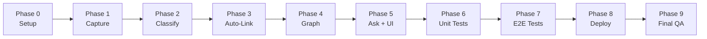

# SecondSelf — Phase-Wise Implementation Plan

This document breaks the SecondSelf build into **10 phases** (0–9), aligned with [architecture.md](./architecture.md) and the weekly milestones in [problem_statement.md](./problem_statement.md).

**Build philosophy:** Each phase produces a testable artifact. Each week's output becomes the next week's input. Use **your own real notes** — not dummy data — when validating.

---

## Phase Overview



| Phase | Name | Maps to | Badge | Primary Output |
|-------|------|---------|-------|----------------|
| 0 | Project Setup | Pre-Week 1 | — | Repo scaffold, config, shared models |
| 1 | Capture Pipeline | Week 1 | The Archivist | `capture.py` + 10+ real captures in `raw/` |
| 2 | Auto-Classification | Week 2.1 | — | `classify.py` + PARA-organized wiki notes |
| 3 | Auto-Linking | Week 2.2 | The Librarian | `link.py` + 15+ linked notes in `wiki/` |
| 4 | Graph Visualization | Week 3 | The Cartographer | `build_graph.py` + interactive graph |
| 5 | RAG Q&A + Streamlit UI | Week 4 | The Oracle | `ask.py`, `app.py`, `pipeline.py` |
| 6 | Local Unit & Integration Tests | — | — | `tests/` suite passing locally |
| 7 | Local End-to-End Testing | — | — | Full pipeline verified on real data |
| 8 | Cloud Deployment | Week 4.2 | — | Live public URL |
| 9 | Final QA + Documentation | — | — | README, GitHub repo, all criteria met |

---

## Phase 0 — Project Setup

**Goal:** Scaffold the repository so every later phase has shared config, data models, and folder structure.

**Prerequisites:** Python 3.11+ installed, Git initialized, Groq API key obtained (needed from Phase 2 onward).

### Tasks

- [ ] **0.1** Initialize Git repo and create folder structure:
  ```
  raw/
  raw/files/
  wiki/
  data/
  models/
  static/
  tests/
  demo/              # anonymized sample data for deployment
  ```
- [ ] **0.2** Create `requirements.txt` with core dependencies (see architecture §7).
- [ ] **0.3** Create `config.py`:
  - Paths: `RAW_DIR`, `WIKI_DIR`, `DATA_DIR`, `GRAPH_PATH`
  - Thresholds: `SIMILARITY_THRESHOLD=0.75`, `MAX_LINKS_PER_NOTE=5`, `TOP_K=5`
  - Load `GROQ_API_KEY` from `.env` via `python-dotenv`
- [ ] **0.4** Create `.env.example` with `GROQ_API_KEY=your_key_here`.
- [ ] **0.5** Create `.gitignore`:
  - Ignore `.env`, `raw/`, `wiki/`, `data/`, `__pycache__/`, `.venv/`
  - Keep `demo/` tracked for deployment
- [ ] **0.6** Create shared data models in `models/`:
  - `models/capture.py` — `RawCapture` dataclass matching architecture §4.1
  - `models/note.py` — `WikiNote` dataclass matching architecture §4.2
  - `models/graph.py` — `GraphNode`, `GraphEdge`, `GraphExport` matching §4.3
- [ ] **0.7** Create virtual environment and install dependencies:
  ```bash
  python -m venv .venv
  .venv\Scripts\activate        # Windows
  pip install -r requirements.txt
  ```
- [ ] **0.8** Add placeholder `README.md` with project title and setup stub.

### Files Created

| File | Purpose |
|------|---------|
| `config.py` | Central paths, thresholds, env vars |
| `models/capture.py` | Raw capture schema |
| `models/note.py` | Wiki note schema |
| `models/graph.py` | Graph export schema |
| `requirements.txt` | Python dependencies |
| `.env.example` | API key template |
| `.gitignore` | Exclude secrets and personal data |

### Acceptance Criteria

- [ ] All folders exist (`raw/`, `wiki/`, `data/`, `models/`, `static/`, `tests/`)
- [ ] `pip install -r requirements.txt` succeeds without errors
- [ ] `from config import RAW_DIR` works; paths resolve correctly
- [ ] `.env` is gitignored; `.env.example` is committed

### Estimated Effort

~1–2 hours

---

## Phase 1 — Capture Pipeline (Week 1)

**Goal:** One command captures any note, link, or file into `raw/` with a timestamp and unique ID.

**Badge:** The Archivist

### Tasks

- [ ] **1.1** Implement ID generator: `{YYYYMMDD}_{6-char-hex}` (e.g. `20260709_a3f9c2`).
- [ ] **1.2** Implement `capture_note(text: str) -> RawCapture`:
  - Write JSON to `raw/{id}.json`
  - Set `type="note"`, `status="pending"`, `captured_at` ISO timestamp
- [ ] **1.3** Implement `capture_link(url: str) -> RawCapture`:
  - Fetch page with `requests` (10s timeout)
  - Extract title + excerpt with `BeautifulSoup`
  - Store `source_url` and extracted `content`
- [ ] **1.4** Implement `capture_file(path: str) -> RawCapture`:
  - Copy file to `raw/files/{id}{ext}`
  - Extract text from PDFs via `pypdf`
  - Store `file_path`, `mime_type`, extracted `content`
- [ ] **1.5** Build CLI in `capture.py` using `typer`:
  ```bash
  python capture.py "My idea about RAG"
  python capture.py --url "https://example.com/article"
  python capture.py --file "./docs/paper.pdf"
  python capture.py --stdin
  ```
- [ ] **1.6** Print capture confirmation: ID, type, and file path on success.
- [ ] **1.7** Capture **10+ real items** from your own scattered notes, links, and files.

### Files Created

| File | Purpose |
|------|---------|
| `capture.py` | CLI + capture logic for note/link/file |

### Test Commands

```bash
python capture.py "Second brain ideas: use PARA method for organization"
python capture.py --url "https://docs.groq.com/"
python capture.py --file "some-local.pdf"
dir raw\                       # verify 10+ JSON files
```

### Acceptance Criteria

- [ ] `raw/` and `wiki/` folder structure exists
- [ ] One command captures a note, a link, AND a file
- [ ] Every capture has a timestamp + unique ID
- [ ] 10+ real items captured (not test data)
- [ ] Raw JSON matches schema in architecture §4.1

### Estimated Effort

~3–4 hours

---

## Phase 2 — Auto-Classification (Week 2.1)

**Goal:** Send raw captures to Groq/Llama 3 and get back PARA category, tags, title, and summary — automatically filing them into `wiki/`.

### Tasks

- [ ] **2.1** Set up Groq client in `classify.py` using `GROQ_API_KEY` from config.
- [ ] **2.2** Write the PARA classification prompt (see architecture §5, Week 2.1).
- [ ] **2.3** Implement `classify_capture(raw: RawCapture) -> WikiNote`:
  - Call LLM with capture content
  - Parse JSON response (`para_category`, `tags`, `title`, `summary`)
  - On parse failure: fallback to `Resources`, empty tags, first 80 chars as title
  - Retry API call up to 3 times on network error
- [ ] **2.4** Implement `write_wiki_note(note: WikiNote) -> Path`:
  - Write `wiki/{id}.md` with YAML frontmatter + markdown body
- [ ] **2.5** Update raw capture `status` to `"classified"` after success; `"error"` on failure.
- [ ] **2.6** Add CLI:
  ```bash
  python classify.py --all              # process all pending
  python classify.py --id 20260709_a3f9c2
  ```
- [ ] **2.7** Run on all Phase 1 captures; verify PARA categories look reasonable.

### Files Created

| File | Purpose |
|------|---------|
| `classify.py` | LLM classification + wiki note creation |

### Test Commands

```bash
python classify.py --all
dir wiki\                      # one .md per classified capture
type wiki\20260709_a3f9c2.md   # check frontmatter
```

### Acceptance Criteria

- [ ] Any raw capture → category + tags + summary automatically
- [ ] PARA categorization working (Projects / Areas / Resources / Archives)
- [ ] Wiki notes have valid YAML frontmatter per architecture §4.2
- [ ] Failed classifications marked `error` in raw JSON, not silently dropped

### Estimated Effort

~3–4 hours

---

## Phase 3 — Auto-Linking (Week 2.2)

**Goal:** Compute embeddings for each note and auto-link semantically related notes — no manual tagging.

**Badge:** The Librarian (complete Week 2 deliverable)

### Tasks

- [ ] **3.1** Load `sentence-transformers` model `all-MiniLM-L6-v2` once at module init in `link.py`.
- [ ] **3.2** Implement embedding store:
  - Save vectors to `data/embeddings.index` (numpy `.npy` or pickle)
  - Save ID mapping to `data/embeddings.meta.json`
- [ ] **3.3** Implement `embed_note(note: WikiNote) -> np.ndarray`:
  - Concatenate `title + "\n" + body` before embedding
- [ ] **3.4** Implement `find_similar(embedding, top_n=10) -> list[tuple[id, score]]`:
  - Cosine similarity against all stored embeddings
  - Return matches above `SIMILARITY_THRESHOLD` (0.75)
- [ ] **3.5** Implement `auto_link(note_id: str)`:
  - Find similar notes (cap at `MAX_LINKS_PER_NOTE=5`)
  - Update `links` in frontmatter of both notes
  - Insert `[[related_id]]` inline in markdown body if missing
- [ ] **3.6** Update raw capture `status` to `"linked"` after processing.
- [ ] **3.7** Add CLI:
  ```bash
  python link.py --all
  python link.py --id 20260709_a3f9c2
  python link.py --rebuild     # re-embed all wiki notes
  ```
- [ ] **3.8** Run on 15+ real items; confirm cross-links appear between related notes.

### Files Created

| File | Purpose |
|------|---------|
| `link.py` | Embeddings + similarity search + auto-linking |
| `data/embeddings.index` | Vector store (generated) |
| `data/embeddings.meta.json` | ID → index mapping (generated) |

### Test Commands

```bash
python link.py --all
python -c "import json; m=json.load(open('data/embeddings.meta.json')); print(len(m), 'embeddings')"
# Inspect a note with links
type wiki\20260709_a3f9c2.md
```

### Acceptance Criteria

- [ ] Embeddings computed per note
- [ ] Related notes auto-linked (no manual tagging)
- [ ] Runs on 15+ real items → organized `wiki/` with links
- [ ] Similarity threshold prevents unrelated link spam
- [ ] Bidirectional links written in both connected notes

### Estimated Effort

~4–5 hours

---

## Phase 4 — Graph Visualization (Week 3)

**Goal:** Convert the linked wiki into a JSON graph and render it as an interactive, hoverable, draggable force-directed visualization.

**Badge:** The Cartographer

### Tasks

- [ ] **4.1** Implement `build_graph.py`:
  - Scan all `wiki/*.md` files
  - Parse frontmatter + extract `[[id]]` links from body
  - Build `GraphNode` list (id, label, category, tags, summary, content_preview)
  - Build `GraphEdge` list (source, target, weight, type)
  - Export to `graph.json` per architecture §4.3
- [ ] **4.2** Add CLI:
  ```bash
  python build_graph.py
  python build_graph.py --output graph.json
  ```
- [ ] **4.3** Create `static/graph.html`:
  - Load vis-network from CDN
  - Accept graph JSON (inline or fetched)
  - Force-directed layout with physics
  - Node colors by PARA category (Projects=blue, Areas=green, Resources=orange, Archives=gray)
  - Node size scaled by connection count
  - Hover tooltip: title, summary, tags, content preview
  - Drag + zoom enabled
  - Optional pulse CSS on high-degree nodes
- [ ] **4.4** Create `static/render_graph.py` helper (optional) to inject JSON into HTML for Streamlit.
- [ ] **4.5** Verify graph opens in browser standalone:
  ```bash
  python build_graph.py
  # Open static/graph.html in browser with graph.json
  ```

### Files Created

| File | Purpose |
|------|---------|
| `build_graph.py` | Wiki → nodes/edges → graph.json |
| `graph.json` | Exported graph data (generated) |
| `static/graph.html` | vis-network interactive renderer |

### Test Commands

```bash
python build_graph.py
python -c "import json; g=json.load(open('graph.json')); print(len(g['nodes']), 'nodes', len(g['edges']), 'edges')"
# Open static/graph.html in browser — hover, drag, zoom
```

### Acceptance Criteria

- [ ] Script builds nodes + edges from notes and exports clean JSON
- [ ] Interactive force-directed graph renders from that JSON
- [ ] Hover reveals note content (title, summary, preview)
- [ ] Drag + zoom work smoothly
- [ ] Built from your real notes, not dummy data
- [ ] Orphan nodes (no links) still appear in the graph

### Estimated Effort

~4–5 hours

---

## Phase 5 — RAG Q&A + Streamlit UI (Week 4)

**Goal:** Wire up natural-language search over your knowledge base and assemble everything into one Streamlit app.

**Badge:** The Oracle (code complete; deployment in Phase 8)

### Tasks

#### 5A — `ask.py` (Retrieval-Augmented Q&A)

- [ ] **5.1** Implement `retrieve(question: str, top_k: int = 5) -> list[WikiNote]`:
  - Embed question with same model as `link.py`
  - Cosine search over `data/embeddings.index`
  - Return top-K wiki notes with similarity scores
- [ ] **5.2** Implement `ask(question: str, top_k: int = 5) -> AskResponse`:
  - Retrieve relevant notes
  - Build context string from note title + body (truncate to ~4K tokens)
  - Send to Groq/Llama 3 with RAG prompt (architecture §5, Week 4.1)
  - Return `answer`, `sources` (note IDs + excerpts), optional `confidence`
  - If no notes above minimum score: return "I don't have notes about that."
- [ ] **5.3** Add CLI for quick testing:
  ```bash
  python ask.py "What did I capture about RAG?"
  python ask.py "Summarize my project ideas"
  ```

#### 5B — `pipeline.py` (Orchestrator)

- [ ] **5.4** Implement `run_pipeline(rebuild: bool = False)`:
  1. `classify.py` — pending → wiki
  2. `link.py` — embed + auto-link
  3. `build_graph.py` — wiki → graph.json
- [ ] **5.5** Add CLI:
  ```bash
  python pipeline.py
  python pipeline.py --id 20260709_a3f9c2
  python pipeline.py --rebuild
  ```

#### 5C — `app.py` (Streamlit UI)

- [ ] **5.6** Build Streamlit app layout (architecture §5, Week 4.2):
  - **Sidebar:** quick capture textarea, "Capture" button, "Run Pipeline" button
  - **Main top:** "Ask your brain..." search input
  - **Main middle:** interactive graph via `st.components.v1.html(static/graph.html)`
  - **Main bottom:** answer panel with cited source note IDs
- [ ] **5.7** Wire sidebar capture → `capture.py` → auto-trigger pipeline
- [ ] **5.8** Prepare `demo/` folder with 5–10 anonymized sample notes + pre-built `demo/graph.json` for cloud deployment (no personal data in repo).

### Files Created

| File | Purpose |
|------|---------|
| `ask.py` | RAG retrieval + LLM synthesis |
| `pipeline.py` | End-to-end orchestrator |
| `app.py` | Streamlit UI (graph + search + capture) |
| `demo/` | Anonymized sample data for deployment |

### Test Commands

```bash
python ask.py "What topics have I been exploring?"
streamlit run app.py
# In browser: ask a question, verify graph renders, try sidebar capture
```

### Acceptance Criteria

- [ ] `ask()` returns answers synthesized from your own notes (retrieval + LLM)
- [ ] Answers include source note citations
- [ ] One Streamlit app contains both the graph and the search bar
- [ ] Sidebar capture → pipeline → graph updates end-to-end locally
- [ ] `pipeline.py` runs full flow without manual steps

### Estimated Effort

~6–8 hours

---

## Phase 6 — Local Unit & Integration Tests

**Goal:** Automated test suite covering core logic — catch regressions before deployment.

### Tasks

- [ ] **6.1** Set up `tests/` with `pytest` (add to `requirements.txt` if missing).
- [ ] **6.2** Unit tests — `tests/test_capture.py`:
  - ID format matches `{YYYYMMDD}_{hex}`
  - Note capture writes valid JSON schema
  - Duplicate content gets different IDs
- [ ] **6.3** Unit tests — `tests/test_classify.py`:
  - Mock Groq response → correct wiki frontmatter
  - Malformed LLM JSON → fallback to Resources category
- [ ] **6.4** Unit tests — `tests/test_link.py`:
  - Cosine similarity returns expected matches for known vectors
  - Threshold filtering excludes low-similarity pairs
  - Max links cap enforced
- [ ] **6.5** Unit tests — `tests/test_build_graph.py`:
  - Sample wiki fixtures → expected node/edge counts
  - Orphan note appears as node with zero edges
- [ ] **6.6** Unit tests — `tests/test_ask.py`:
  - Mock retrieval → answer includes source IDs
  - Empty retrieval → graceful "no notes" message
- [ ] **6.7** Integration test — `tests/test_pipeline.py`:
  - Fixture raw captures → classify → link → graph.json exists with nodes
- [ ] **6.8** Run full suite:
  ```bash
  pytest tests/ -v
  ```

### Files Created

| File | Purpose |
|------|---------|
| `tests/test_capture.py` | Capture logic tests |
| `tests/test_classify.py` | Classification tests (mocked LLM) |
| `tests/test_link.py` | Embedding + linking tests |
| `tests/test_build_graph.py` | Graph export tests |
| `tests/test_ask.py` | RAG tests (mocked LLM) |
| `tests/test_pipeline.py` | Integration test |
| `tests/fixtures/` | Sample raw/wiki JSON and markdown |

### Acceptance Criteria

- [ ] `pytest tests/ -v` passes with zero failures
- [ ] LLM and embedding calls mocked in unit tests (no API key needed for CI)
- [ ] Integration test covers capture → classify → link → graph without manual steps

### Estimated Effort

~3–4 hours

---

## Phase 7 — Local End-to-End Testing

**Goal:** Validate the complete system on real personal data before deploying publicly.

### Tasks

- [ ] **7.1** **Capture test:** Add 3 new real items (1 note, 1 link, 1 file) via CLI and Streamlit sidebar.
- [ ] **7.2** **Pipeline test:** Run `python pipeline.py` — verify all 3 appear in `wiki/` with PARA categories.
- [ ] **7.3** **Link test:** Confirm at least one new auto-link was created to an existing note.
- [ ] **7.4** **Graph test:** Open Streamlit app — graph shows all nodes; hover reveals content; drag/zoom work.
- [ ] **7.5** **Ask test:** Ask 5 real questions you know the answer to from your notes:
  - Verify answers are factually grounded in your captures
  - Verify source citations point to correct note IDs
  - Verify graceful response when asking about something not in your notes
- [ ] **7.6** **Error path test:**
  - Capture empty string → handled gracefully
  - Invalid URL → error message, no crash
  - Missing PDF → error message, no crash
- [ ] **7.7** **Performance check** (architecture §12 targets):
  - Capture < 1s
  - Classify one note < 5s
  - Ask one question < 10s
  - Graph renders smoothly with your full note count
- [ ] **7.8** Document any issues found in a brief test log (fix before Phase 8).

### E2E Verification Checklist

| Step | Command / Action | Expected Result |
|------|------------------|-----------------|
| Capture note | `python capture.py "test note"` | JSON in `raw/`, ID printed |
| Capture link | `python capture.py --url <url>` | Title + excerpt stored |
| Capture file | `python capture.py --file <pdf>` | File copied, text extracted |
| Classify all | `python classify.py --all` | Wiki `.md` files created |
| Link all | `python link.py --all` | Embeddings saved, links inserted |
| Build graph | `python build_graph.py` | `graph.json` with nodes + edges |
| Ask question | `python ask.py "<question>"` | Answer + source citations |
| Full pipeline | `python pipeline.py` | All steps complete sequentially |
| Streamlit UI | `streamlit run app.py` | Graph + search + capture all work |

### Acceptance Criteria

- [ ] End-to-end flow verified: capture → classify → link → graph → ask
- [ ] All 4 weekly milestone outputs present (raw/, wiki/, graph.json, working ask)
- [ ] No crashes on happy path or common error inputs
- [ ] Answers grounded in your notes, not hallucinated general knowledge

### Estimated Effort

~2–3 hours

---

## Phase 8 — Cloud Deployment

**Goal:** Deploy the Streamlit app to a free platform and obtain a public URL.

### Tasks

- [ ] **8.1** Prepare repo for public GitHub push:
  - Ensure `.gitignore` excludes `raw/`, `wiki/`, `data/`, `.env`
  - Commit `demo/` with anonymized sample notes + pre-built `demo/graph.json`
  - Update `app.py` to load from `demo/` when env var `USE_DEMO_DATA=true` (for cloud)
- [ ] **8.2** Write deployment section in `README.md`:
  - Local setup instructions
  - Environment variables needed
  - How to run locally vs. demo mode
- [ ] **8.3** Push to public GitHub repository.
- [ ] **8.4** Deploy to **Streamlit Cloud** (recommended) or **Hugging Face Spaces**:
  - Connect GitHub repo
  - Set main file: `app.py`
  - Add secret: `GROQ_API_KEY`
  - Set env: `USE_DEMO_DATA=true`
- [ ] **8.5** Wait for build to complete; note the public URL.
- [ ] **8.6** Smoke test the deployed app (detailed in Phase 9).

### Deployment Config (Streamlit Cloud)

| Setting | Value |
|---------|-------|
| Repository | `your-user/secondself` |
| Branch | `main` |
| Main file | `app.py` |
| Python version | 3.11 |
| Secrets | `GROQ_API_KEY` |
| Environment | `USE_DEMO_DATA=true` |

### Acceptance Criteria

- [ ] Public GitHub repo with clean README + setup instructions
- [ ] Deployed live with a public URL
- [ ] App loads without errors on the public URL
- [ ] No personal data or API keys committed to repo

### Estimated Effort

~2–3 hours

---

## Phase 9 — Final QA + Documentation

**Goal:** Final round of testing on the deployed app; confirm all project deliverables are complete.

### Tasks

- [ ] **9.1** **Deployed smoke test:**
  - Public URL loads within 30 seconds
  - Graph renders with demo nodes
  - Hover shows note content
  - Ask bar returns an answer with citations
  - No console errors in browser dev tools
- [ ] **9.2** **Full deliverables checklist** (from problem statement):
  - [ ] Public GitHub repo with clean README + setup instructions
  - [ ] Live deployed URL — interactive graph + ask-your-brain search, both working
  - [ ] End-to-end flow verified: capture → classify → link → graph → ask
  - [ ] All 4 weekly milestones complete
- [ ] **9.3** **Badge checklist:**
  - [ ] The Archivist — capture pipeline + 10+ real captures
  - [ ] The Librarian — auto-classify + auto-link + 15+ wiki notes
  - [ ] The Cartographer — interactive force-directed graph
  - [ ] The Oracle — RAG Q&A + deployed Streamlit app
- [ ] **9.4** Finalize `README.md`:
  - Project description and architecture diagram link
  - Prerequisites (Python 3.11+, Groq API key)
  - Local setup (venv, pip install, .env)
  - Usage examples for each CLI command
  - Streamlit run instructions
  - Deployed demo URL
  - Project structure overview
- [ ] **9.5** Tag release: `git tag v1.0.0` (optional).

### Final Acceptance Criteria

- [ ] `ask()` returns answers synthesized from notes on deployed app
- [ ] One Streamlit app contains both graph and search bar (local + deployed)
- [ ] Deployed live with public URL accessible to anyone
- [ ] Full pipeline works end-to-end in deployed app (demo mode)
- [ ] README enables a new developer to set up and run locally

### Estimated Effort

~2–3 hours

---

## Complete Build Order (Quick Reference)

Execute phases sequentially. Do not skip ahead — each phase depends on the previous.

```
Phase 0  →  Scaffold repo, config, models, requirements
Phase 1  →  capture.py → test on 10+ real items
Phase 2  →  classify.py → PARA on all raw captures
Phase 3  →  link.py → embeddings + auto-link 15+ notes
Phase 4  →  build_graph.py + static/graph.html
Phase 5  →  ask.py + pipeline.py + app.py
Phase 6  →  pytest suite (unit + integration)
Phase 7  →  E2E test on real data locally
Phase 8  →  Push GitHub + deploy Streamlit Cloud
Phase 9  →  Final QA on deployed URL + README
```

---

## Environment & Secrets Reference

| Variable | Required From | Purpose |
|----------|---------------|---------|
| `GROQ_API_KEY` | Phase 2+ | LLM classification and RAG synthesis |
| `USE_DEMO_DATA` | Phase 8 (cloud) | Load demo/ instead of personal raw/wiki |

Local `.env` example:

```env
GROQ_API_KEY=gsk_xxxxxxxxxxxxxxxx
USE_DEMO_DATA=false
```

---

## Risk Register

| Risk | Phase | Mitigation |
|------|-------|------------|
| Groq API rate limits | 2, 5 | Batch with delays; cache classifications |
| sentence-transformers slow first load | 3 | Model downloads once; document in README |
| No similar notes to link early on | 3 | Expected with < 5 notes; test after 15+ |
| Streamlit Cloud build timeout | 8 | Pin dependency versions; use demo data |
| Personal data accidentally committed | 8 | `.gitignore` + pre-push checklist |
| LLM returns invalid JSON | 2, 5 | Fallback defaults; retry logic |

---

## Total Estimated Timeline

| Phase | Effort |
|-------|--------|
| 0 — Setup | 1–2 hrs |
| 1 — Capture | 3–4 hrs |
| 2 — Classify | 3–4 hrs |
| 3 — Auto-Link | 4–5 hrs |
| 4 — Graph | 4–5 hrs |
| 5 — Ask + UI | 6–8 hrs |
| 6 — Unit Tests | 3–4 hrs |
| 7 — E2E Tests | 2–3 hrs |
| 8 — Deploy | 2–3 hrs |
| 9 — Final QA | 2–3 hrs |
| **Total** | **~31–41 hours** |

Aligned with the 4-week cadence in the problem statement (~8–10 hrs/week).

---

## Next Step

After this plan is approved, proceed to:

1. **Generate `edge-case.md`** — corner scenarios and edge cases for each phase
2. **Implement Phase 0** — scaffold the repo per this document
